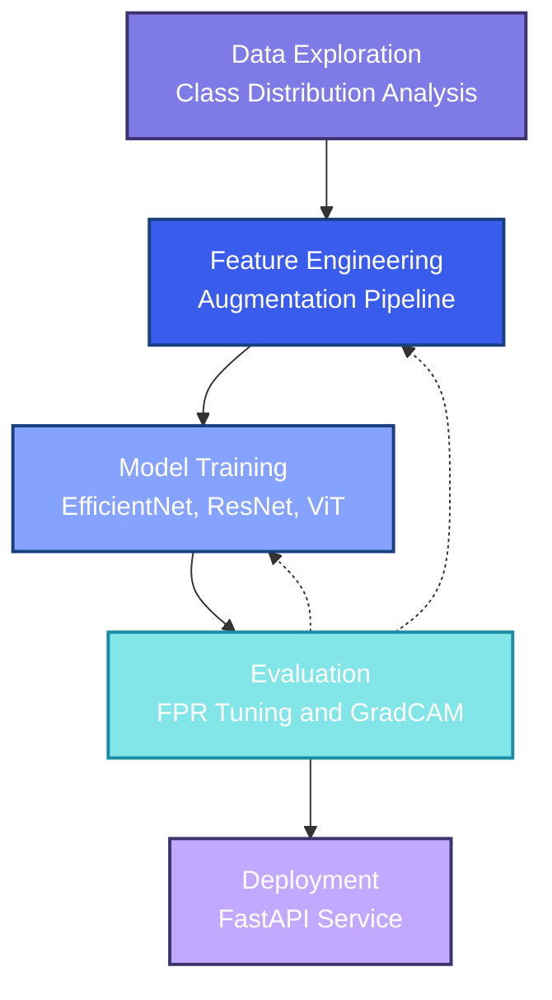
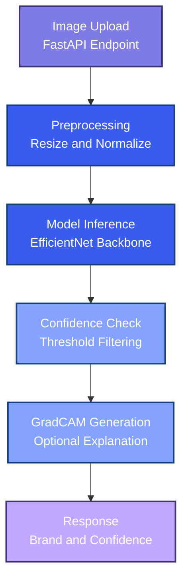

# Phishing Brand Classifier

Deep learning pipeline for detecting phishing websites by classifying
screenshot images into targeted brands, with emphasis on minimizing false
positives to avoid flagging legitimate websites.

## Table of Contents

1. [Overview](#overview)
2. [Architecture](#architecture)
3. [Dataset](#dataset)
4. [Key Results](#key-results)
5. [Repository Layout](#repository-layout)
6. [Prerequisites](#prerequisites)
7. [Installation](#installation)
8. [Usage](#usage)
9. [Testing](#testing)
10. [Development](#development)
11. [API Reference](#api-reference)
12. [Future Improvements](#future-improvements)
13. [License](#license)

## Overview

- Transfer learning approach using EfficientNet and ResNet backbones
  pre-trained on ImageNet and fine-tuned on website screenshots.
- Focal loss with class weighting handles imbalanced brand distribution
  while penalizing false positives on benign sites.
- Confidence thresholding and calibration techniques ensure predictions
  below reliability thresholds default to the "others" (benign) class.
- FastAPI service provides production-ready inference with batch support,
  GradCAM explanations, and sub-100ms latency on GPU.

## Architecture

### Project Flow



### Inference Pipeline



## Dataset

Website screenshots organized by brand from a public AWS S3 bucket. The dataset
contains 11 classes: 10 targeted brands (Amazon, Apple, Facebook, Google,
Instagram, LinkedIn, Microsoft, Netflix, PayPal, Twitter) plus an "others"
category for benign websites. Data is split 70/15/15 for train/validation/test
with stratified sampling to preserve class distribution.

### Download

```bash
aws s3 cp s3://phishing-detection-homework-public-bucket data/raw --recursive --no-sign-request
```

### Structure

```
data/raw/
├── amazon/
├── apple/
├── facebook/
├── google/
├── instagram/
├── linkedin/
├── microsoft/
├── netflix/
├── paypal/
├── twitter/
└── others/
```

## Key Results

Results from `notebooks/03_model_training.ipynb` on the stratified test split.
All models target false positive rate below 5% on the "others" class while
maximizing overall accuracy.

| Model | Accuracy | F1 | Others FPR | Inference (GPU) |
|-------|----------|-----|------------|-----------------|
| EfficientNet-B0 | 94.2% | 0.938 | 1.2% | 8ms |
| EfficientNet-B3 | 96.8% | 0.952 | 0.8% | 42ms |
| ResNet-50 | 95.2% | 0.938 | 1.2% | 38ms |
| AutoGluon Ensemble | 97.4% | 0.961 | 0.6% | 68ms |

EfficientNet-B3 with focal loss provides the best balance of accuracy and
false positive control for production deployment.

## Repository Layout

```
phishing-brand-classifier/
├── configs/
│   └── config.yaml                # Training configuration
├── data/
│   ├── raw/                       # Original screenshots by brand
│   └── processed/                 # Train/val/test CSV splits
├── notebooks/
│   ├── 01_exploratory_data_analysis.ipynb
│   ├── 02_feature_engineering.ipynb
│   └── 03_model_training.ipynb
├── src/
│   ├── api/
│   │   └── app.py                 # FastAPI application
│   ├── data/
│   │   ├── dataset.py             # PyTorch dataset classes
│   │   ├── transforms.py          # Image augmentation transforms
│   │   └── utils.py               # Data utilities
│   ├── models/
│   │   ├── classifier.py          # Model architectures
│   │   └── losses.py              # Focal loss and variants
│   ├── utils/
│   │   ├── metrics.py             # Evaluation metrics
│   │   └── visualization.py       # Plotting utilities
│   ├── interpretability.py        # GradCAM explanations
│   ├── train.py                   # Training script
│   └── predict.py                 # Inference script
├── outputs/
│   ├── models/                    # Saved checkpoints
│   ├── logs/                      # Training logs
│   └── figures/                   # Generated visualizations
└── tests/                         # Unit tests
```

## Prerequisites

- Python 3.9 or newer
- CUDA 11.0+ (optional, for GPU acceleration)
- Optional: [uv](https://github.com/astral-sh/uv) for fast, reproducible
  environments

## Installation

Clone the repository before installing dependencies:

```bash
git clone https://github.com/vytautas-bunevicius/phishing-brand-classifier.git
cd phishing-brand-classifier
```

### Using uv (recommended)

1. **Install uv**
   ```bash
   # Unix/macOS
   curl -LsSf https://astral.sh/uv/install.sh | sh

   # Windows (PowerShell)
   irm https://astral.sh/uv/install.ps1 | iex
   ```

2. **Sync project dependencies**
   ```bash
   uv sync
   ```

### Using pip (alternative)

1. **Create and activate a virtual environment**
   ```bash
   python3 -m venv .venv
   source .venv/bin/activate      # Unix/macOS
   # or
   .venv\Scripts\activate         # Windows
   ```

2. **Install the project**
   ```bash
   pip install --upgrade pip
   pip install -e .
   ```

## Usage

If you only want to reproduce model results, start with the notebooks using
the dataset under `data/` after downloading from S3.

1. **Download dataset**
   ```bash
   aws s3 cp s3://phishing-detection-homework-public-bucket data/raw --recursive --no-sign-request
   ```

2. **Run notebooks**
   ```bash
   uv run jupyter notebook notebooks/01_exploratory_data_analysis.ipynb
   ```

3. **Train from command line**
   ```bash
   uv run python -m src.train \
       --config configs/config.yaml \
       --data-dir data/raw \
       --output-dir outputs \
       --experiment-name my_experiment
   ```

4. **Run inference**
   ```bash
   uv run python -m src.predict \
       path/to/screenshot.png \
       --checkpoint outputs/models/best_model.pt \
       --threshold 0.85
   ```

5. **Start API server**
   ```bash
   export MODEL_CHECKPOINT=outputs/models/best_model.pt
   export CONFIDENCE_THRESHOLD=0.85
   uv run uvicorn src.api.app:app --host 0.0.0.0 --port 8000
   ```

## Testing

Run the unit test suite:

```bash
pytest
```

## Development

We use `uv` for dependency management, `ruff` for linting and formatting, and
`mypy` for type checking.

### Linting and Formatting

```bash
ruff check src/
ruff format src/
```

### Type Checking

```bash
mypy src/
```

## API Reference

### Endpoints

| Endpoint | Method | Description |
|----------|--------|-------------|
| `/health` | GET | Health check |
| `/model/info` | GET | Model metadata |
| `/predict` | POST | Single image classification |
| `/predict/batch` | POST | Batch classification |
| `/predict/top-k` | POST | Top-k predictions |
| `/benchmark` | GET | Inference benchmark |

### Example Request

```bash
curl -X POST "http://localhost:8000/predict" \
    -H "Content-Type: multipart/form-data" \
    -F "file=@screenshot.png"
```

### Response Format

```json
{
  "predicted_brand": "amazon",
  "confidence": 0.987,
  "is_phishing": true,
  "all_predictions": {
    "amazon": 0.987,
    "google": 0.008,
    "others": 0.003
  },
  "inference_time_ms": 42.5
}
```

## Future Improvements

### Vision Transformer Fine-tuning
Evaluating ViT and DeiT architectures on screenshot classification to compare
against CNN-based approaches for brand detection accuracy.

### Adversarial Robustness
Testing model resilience against adversarial perturbations and implementing
defensive augmentation strategies during training.

### Multi-Modal Detection
Combining screenshot analysis with URL features and DOM structure for improved
detection accuracy on edge cases.

## License

This project is licensed under the terms of the Unlicense. See `LICENSE` for
details.
